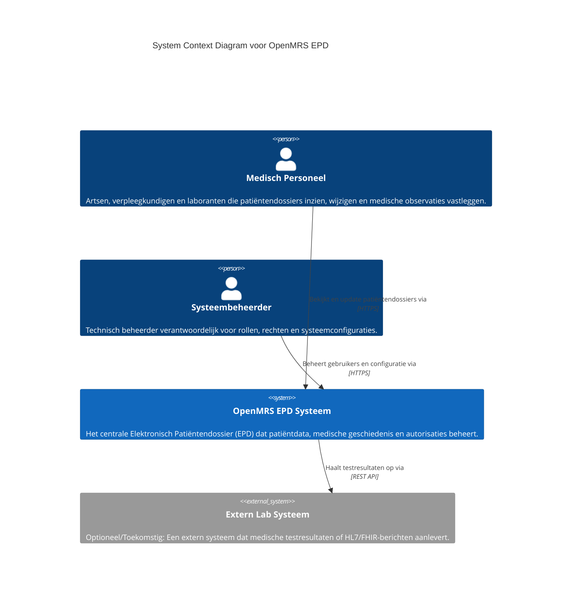
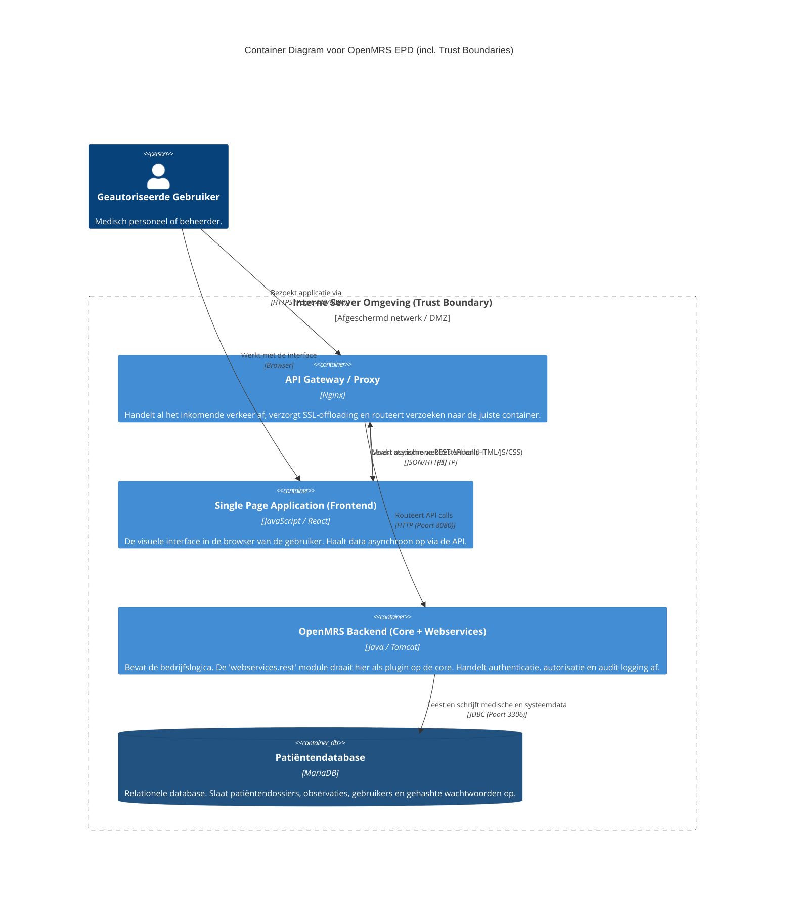

# 03. Architectuur en Systeemcontext (C4 Model)

In het kader van threat modeling en risicoanalyse is het essentieel om inzichtelijk te maken hoe het OpenMRS EPD-systeem is opgebouwd, welke actoren ermee interacteren en waar de beveiligingsgrenzen (Trust Boundaries) liggen. Hiervoor gebruiken we het **C4-model**, een gestandaardiseerde methode voor het visualiseren van softwarearchitectuur.

Voor dit auditrapport zijn twee detailniveaus uitgewerkt:
1. **Level 0 (Context):** Het systeem in relatie tot zijn omgeving (gebruikers en externe systemen).
2. **Level 1 (Container):** De interne technische applicaties (containers) waaruit het systeem is opgebouwd.

---

## 1. Level 0: Systeem Context Diagram (Het Helikopterperspectief)

Het Context-diagram geeft een hoogoverzicht. Het toont niet *hoe* het systeem technisch in elkaar zit, maar *wie* het gebruikt en met *welke andere systemen* het praat. Dit niveau is bedoeld voor zowel technische als niet-technische stakeholders (zoals management en auditors).

### Gedetailleerde uitleg (Context)
* **Medisch Personeel (Actor):** Dit is de primaire eindgebruiker. Omdat deze gebruiker toegang heeft tot zeer gevoelige gezondheidsgegevens (Patiëntendossiers, BSN, diagnoses), valt de interactie tussen deze actor en het systeem direct onder zware eisen van de NEN-7510 (authenticatie, autorisatie, logging).
* **Systeembeheerder (Actor):** Heeft verhoogde privileges (`Manage Privileges`, `Manage Roles`). Een accountcompromittatie van deze actor is een kritiek risico (Threat).
* **Het Systeem (OpenMRS):** Het primaire doelsysteem van deze audit. Alles binnen dit blok is de verantwoordelijkheid van het ontwikkel- en beheamteam.
* **Externe systemen:** Mocht OpenMRS communiceren met externe lab-systemen, dan vormt die koppeling een apart risico (bijv. onveilige API-koppelingen, gebrek aan mTLS).

---

## 2. Level 1: Container Diagram (De Technische Architectuur)

We zoomen nu één niveau in. Het "OpenMRS EPD Systeem" blok wordt opengebroken om te laten zien uit welke afzonderlijk te deployen applicaties ("Containers") het bestaat. Dit is cruciaal voor security, omdat we hier de **Trust Boundaries** (vertrouwensgrenzen) kunnen uittekenen. Een aanvaller moet over deze grenzen heen stappen om bij de data te komen.

### Gedetailleerde uitleg (Containers & Security)

1. **API Gateway (Nginx):** 
   Dit is de eerste verdedigingslinie. Het enige onderdeel dat direct verbonden is met het publieke internet (of het wijdere ziekenhuisnetwerk). Bij een DDoS-aanval of verkeerd geconfigureerde headers (zoals ontbrekende Content-Security-Policy), is dit het punt van ingrijpen.
2. **Single Page Application (React Frontend):** 
   Hoewel dit binnen het systeem valt, draait de code daadwerkelijk in de browser van de gebruiker (Client-side). Dit is de attack vector voor risico's zoals Cross-Site Scripting (XSS). Omdat de code client-side is, mag deze nóóit gevoelige logica of hardcoded secrets bevatten.
3. **OpenMRS Backend (Java/Tomcat):**
   Het kloppende hart van het EPD. Hier bevindt zich de `webservices.rest` module. Dit is de locatie waar security-filters worden toegepast, waaronder:
   * **Authenticatie (AUTH-1):** Controleren van inloggegevens.
   * **IP-Filtering (IP-1):** Blokkeren van ongewenste IP-adressen via de Rest module properties.
   * **Audit Logging (LOG-1):** Vastleggen van de 5 W's naar het fysieke logbestand.
   * **Foutafhandeling (INFO-1):** Zorgen dat Exception Stack Traces niet teruglekken naar de frontend.
4. **Patiëntendatabase (MariaDB):**
   De database is de "Kroonjuwelen" van de applicatie. Deze container zit het diepst in de infrastructuur en is onbereikbaar vanaf het internet (alleen bereikbaar via de Backend). Bevat zwaar beveiligde medische data.

### Connectie met Threat Modeling
* De lijnen in dit diagram vertegenwoordigen de attack surface (aanvalsoppervlak). 
* Data die via JDBC (Backend naar Database) stroomt, of via JSON/HTTP (Frontend naar Backend), kan onderschept worden als deze niet via beveiligde kanalen (TLS) loopt.
* De **Trust Boundary** rondom de interne serveromgeving markeert de scheiding tussen het "onveilige" externe netwerk en het "veilige" interne systeem. Kwetsbaarheden in componenten die deze grens overschrijden (zoals poort 80/443 bij Nginx) hebben doorgaans een hogere CVSS-score vanwege de lage complexiteit en hoge toegankelijkheid.
